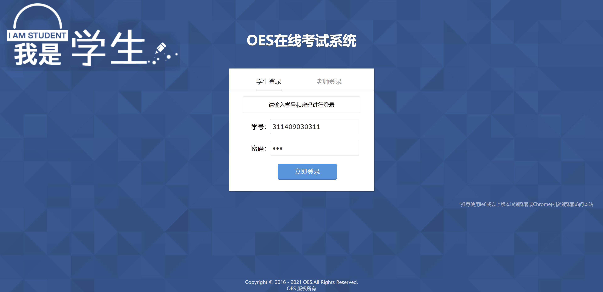
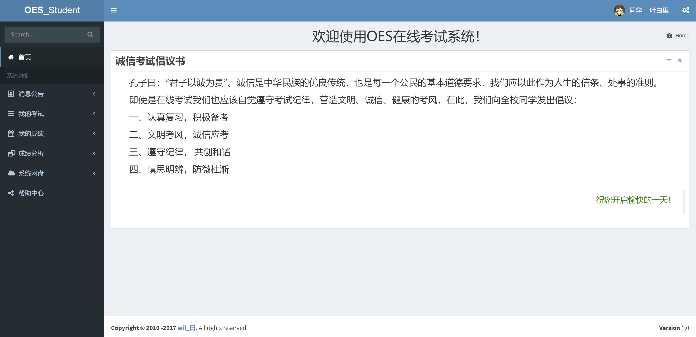
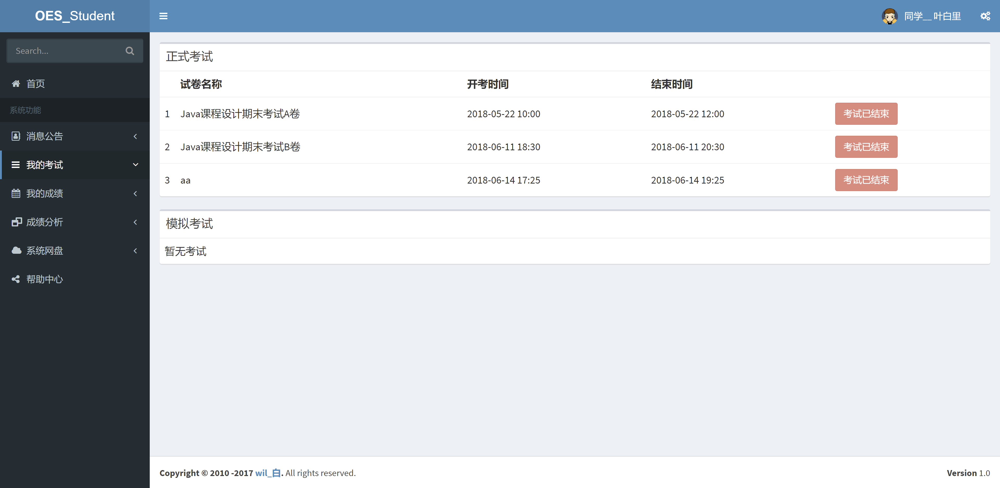
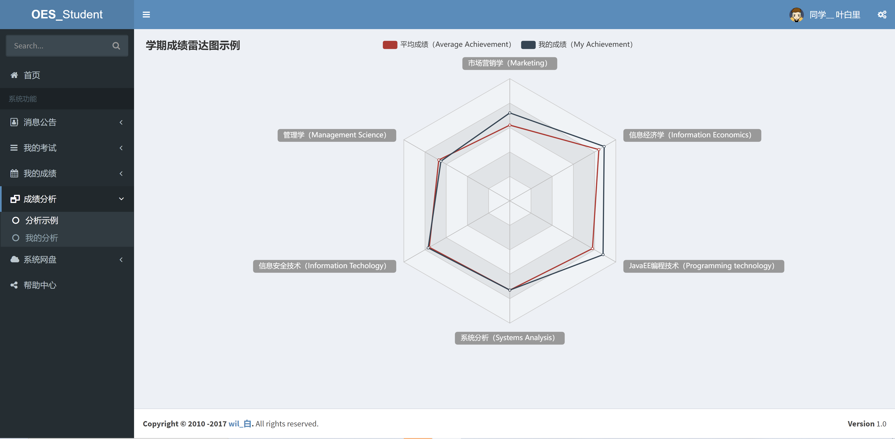
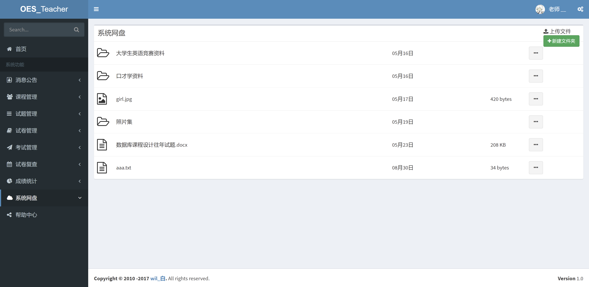
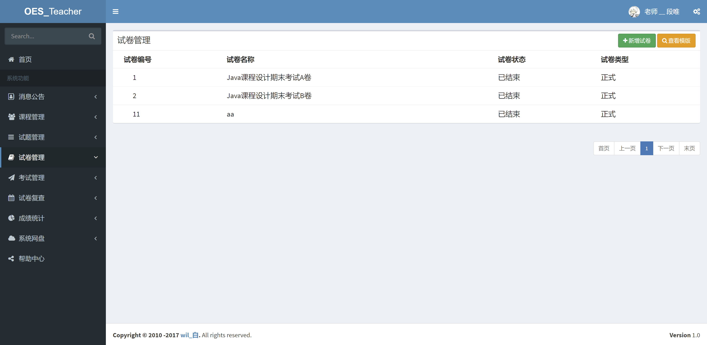
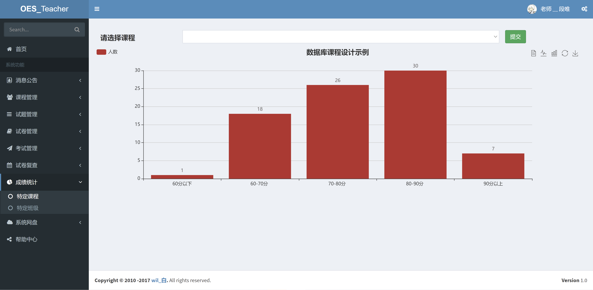
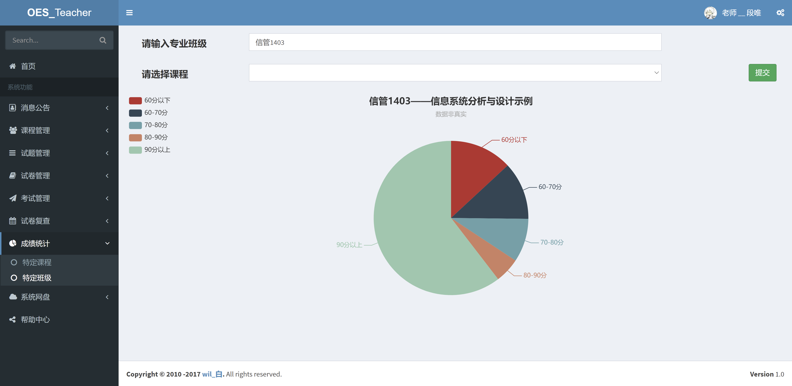

<h1 align="center">在线考试管理系统2</h1>

## 简介
在线考试管理系统2：角色分为学生和教师；用户登录、考试安排、试题管理、成绩查询、资源管理、成绩分析、课程管理及消息公告多个功能模块。    --计算机毕业设计源码；毕设源码；java毕业设计源码

## 联系方式

<h3 align="center">获取完整代码与数据库文件 + 微信：deepguan QQ: 86050149 QQ群: 783742310</h3>

<h3 align="center">可帮忙远程部署 包运行成功！提供远程部署、修改代码、设计文档指导、代码讲解等服务！</h3>

## 功能介绍（完整见运行截图）
教师：教师在在线考试管理系统中可以通过考试安排模块创建、编辑和发布考试，设置考试时间和考试范围，确保考试的组织和顺利进行。试题管理功能允许教师添加、删除和修改试题，支持选择题、填空题和论述题等多种题型。系统网盘提供资源管理功能，教师可上传和管理考试相关资料。成绩统计模块提供直方图和饼状图显示学生成绩分布，帮助教师分析教学效果并进行改进。

学生：学生可以通过系统的用户登录功能输入学号和密码进入在线考试管理系统，查看考试安排和考试状态，参加正式或模拟考试。系统允许学生访问和管理自己的考试信息、查看考试成绩和成绩分析，便于了解个人学习情况和水平。学生可在系统网盘中下载教师提供的备考材料，同时也能上传作业或文件以供教师查阅。此外，轻松导航至帮助中心和消息公告，及时了解系统使用指南和考试通知。

## 运行截图

本代码来源于网络,仅供学习参考使用!

